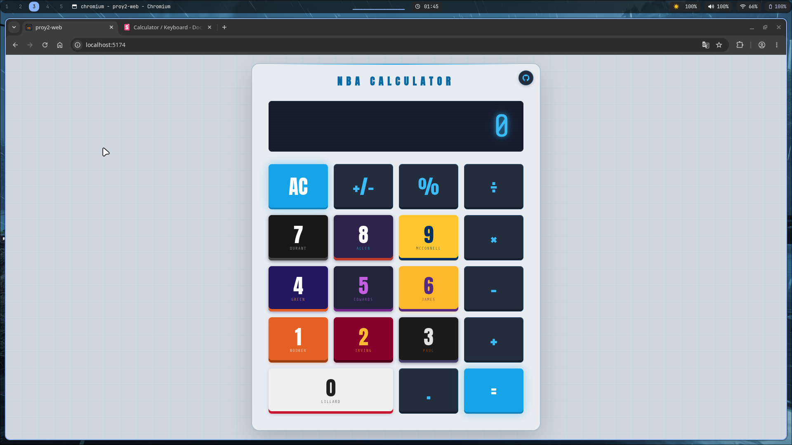
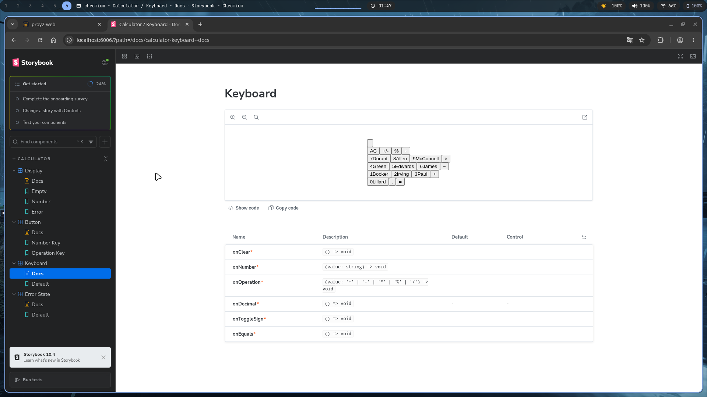

# NBA Calculator 🏀

Calculadora con temática de la NBA implementada con React, TypeScript y Vite. Cada botón numérico representa a un jugador icónico con los colores de su camiseta.

## Screenshots

### Calculadora


### Storybook


## Cómo correr el proyecto

### Requisitos

- [Bun](https://bun.sh/) (package manager y runtime)
- Un navegador moderno

### Instalación

```bash
git clone https://github.com/MarceloDetlefsen/proy2-web.git
cd proy2-web
bun install
```

### Desarrollo

```bash
bun dev
```

### Build

```bash
bun run build
```

### Tests

```bash
bun test
```

### Lint

```bash
bun lint
```

### Storybook

```bash
bun storybook
```

### Estructura del proyecto

```
.
├── .github/
│   └── workflows/
│       └── ci.yml            # CI con GitHub Actions
├── .storybook/
│   ├── main.ts
│   └── preview.ts
├── src/
│   ├── components/
│   │   ├── CalcButton.tsx    # Botón individual con nombre de jugador
│   │   ├── Calculator.tsx    # Componente raíz de la calculadora
│   │   ├── Display.tsx       # Pantalla de resultado
│   │   └── Keyboard.tsx      # Grilla de botones
│   ├── hooks/
│   │   └── useCalculator.tsx # Lógica completa de la calculadora
│   ├── stories/
│   │   ├── Button.stories.ts
│   │   ├── Display.stories.ts
│   │   ├── ErrorState.stories.tsx
│   │   ├── Keyboard.stories.ts
│   │   └── ...
│   ├── test/
│   │   ├── calcButton.test.tsx
│   │   ├── calculator.test.ts
│   │   ├── calculatorComponent.test.tsx
│   │   ├── display.test.tsx
│   │   └── keyboard.test.tsx
│   ├── App.tsx
│   ├── index.css
│   └── main.tsx
├── index.html
├── package.json
├── vite.config.ts
├── vitest.config.ts
└── README.md
```

## Operaciones

| Operación | Botón | Notas |
|-----------|-------|-------|
| Suma | `+` | |
| Resta | `−` | Permite resultados negativos |
| Multiplicación | `×` | |
| División | `÷` | Divide por cero → `ERROR` |
| Módulo | `%` | Residuo entero |
| Decimal | `.` | Cuenta como carácter en el límite |
| Cambio de signo | `+/-` | El `-` cuenta como carácter |
| Limpiar | `AC` | Resetea todo el estado |

## Jugadores por tecla

| Tecla | Jugador | Equipo | Uniform |
|-------|---------|--------|---------|
| `0` | Damian Lillard | Trail Blazers | Association Edition
| `1` | Devin Booker | Suns | Statement 2020/2021
| `2` | Kyrie Irving | Cavaliers | Icon Edition
| `3` | Chris Paul | Suns | City Edition 2020/2021
| `4` | Jalen Green | Suns | Icon Edition
| `5` | Anthony Edwards | Timberwolves | City Edition 2018/2019
| `6` | LeBron James | Lakers | Icon Edition
| `7` | Kevin Durant | Nets | City Edition 2018/2019
| `8` | Ray Allen | Suns | City Edition 2024/2025
| `9` | T.J. McConnell | Pacers | Statement Edition

## Componentes React

| Componente | Responsabilidad |
|------------|-----------------|
| `Calculator` | Contenedor raíz, conecta hook con UI |
| `Display` | Muestra el valor actual, maneja estado de error |
| `Keyboard` | Grilla de botones, botón flotante de GitHub |
| `CalcButton` | Botón individual con número y nombre de jugador |

## Hook: `useCalculator`

Toda la lógica de la calculadora vive en `useCalculator`. Maneja:

- **Estado del display** vía `useState` + `useRef` para evitar closures desactualizados
- **Operaciones encadenadas**: al presionar un operador con operación pendiente, resuelve antes de registrar el nuevo
- **Límite de 9 caracteres**: aplicado tanto al ingreso de datos como al resultado (incluyendo `.` y `-`)
- **Resultados decimales continuos** (ej. `22 ÷ 7`): se trunca la precisión hasta que el resultado quepa en 9 caracteres
- **División por cero**: detectada explícitamente → `ERROR`
- **Resultados fuera de rango** (`> 999999999` o `< -999999999`) → `ERROR`

## Funcionalidades implementadas

| Funcionalidad | Descripción |
|---------------|-------------|
| Operaciones básicas | `+`, `-`, `×`, `÷`, `%` |
| Punto decimal | Cuenta como carácter en el límite de 9 |
| Cambio de signo | `+/-` convierte el operando actual en negativo |
| Resultados negativos | La resta puede producir resultados negativos válidos |
| Límite de display | Máximo 9 caracteres en ingreso y resultado |
| Manejo de errores | División por cero y desbordamiento muestran `ERROR` |
| Operaciones encadenadas | `5 + 3 + 2` resuelve en cadena correctamente |
| Accesibilidad | `aria-label`, `aria-live`, roles semánticos |
| Botón GitHub | FAB flotante en esquina superior derecha |

## Detalles técnicos

- El estado del display se duplica en un `useRef` (`displayRef`) para que los handlers siempre lean el valor más reciente sin necesidad de re-renders
- `formatResult` itera de mayor a menor precisión hasta encontrar una representación que quepa en 9 caracteres
- La división por cero se detecta **antes** de llamar a `calculate` para evitar `Infinity`
- Los tests de unidad corren con `jsdom` vía `vitest`; los tests de Storybook corren en Chromium headless vía Playwright

## CI

GitHub Actions corre en cada push y PR a `main`:

1. Instala dependencias con `bun install --frozen-lockfile`
2. Ejecuta `bun lint`
3. Ejecuta `bun test`

## Checklist de puntos
 
| Criterio | Puntos | Implementado |
|----------|--------|:------------:|
| Diseño de interfaz interesante (criterio subjetivo) | 20 | ✅ |
| Tests no triviales (5 pts c/u, máx 25) — **5 suites, 20 tests** | 25 | ✅ |
| Historias de Storybook distintas (5 pts c/u, máx 25) — **5 historias** | 25 | ✅ |
| Código compliant con JavaScript Standard | 10 | ✅ |
| Regla custom: prohibir punto y coma | — | ✅ |
| Regla custom: máximo 120 caracteres por línea | — | ✅ |
| Script `lint` sin errores | — | ✅ |
| Punto decimal (cuenta como carácter en el límite de 9) | 5 | ✅ |
| Operación división (con manejo de decimales y límite de 9 chars) | 10 | ✅ |
| Operación módulo | 5 | ✅ |
| Función `+/-` (signo cuenta como carácter en el límite de 9) | 5 | ✅ |
| Hook propio (`useCalculator`) | 10 | ✅ |
| Ningún archivo de componente supera 20 líneas | 20 | ❌ |
| Title y favicon distintos al default | 5 | ✅ |
| TypeScript | 5 | ✅ |
| Bun como package manager (lockfile commiteado) | 5 | ✅ |
| CI con GitHub Actions (tests + lint automáticos) | 5 | ✅ |
| Atributos de accesibilidad (`aria-label`, `aria-live`, roles) | 5 | ✅ |
| **Total estimado** | **140 / 160** | |

## 👨‍💻 Autor

Marcelo Detlefsen - 24554